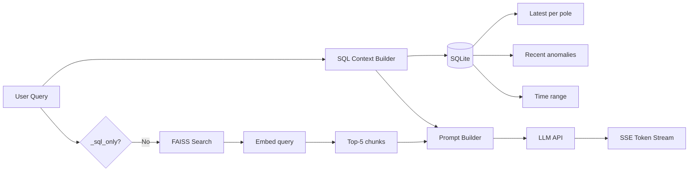

# Hybrid SQL + RAG Pipeline

The RAG pipeline is the core intelligence of CogniLight's AI chat. It combines two context sources — direct SQL queries for structured data and semantic search over incident logs — to build a rich prompt for the LLM.

---

## Pipeline Overview



---

## Step 1: Query Classification

RAG context is **included by default**. The `_sql_only()` function identifies the small set of trivial factual queries where incident logs add no value:

```python
_SQL_ONLY_KEYWORDS = re.compile(
    r"(?:what time|current time|how many poles|number of poles|list (?:all )?poles)",
    re.I,
)

def _sql_only(query: str) -> bool:
    return bool(_SQL_ONLY_KEYWORDS.search(query))
```

This opt-out approach is simpler and more robust than trying to enumerate all keywords that *should* trigger RAG. Most user questions benefit from narrative incident context, so it makes sense to include it unless we're confident it's unnecessary.

**Examples:**

| Query | RAG? | Why |
|-------|------|-----|
| "Which poles consume the most energy?" | Yes | Included by default — incident context may explain spikes |
| "Have there been any recurring sensor problems?" | Yes | Included by default — incident logs are directly relevant |
| "What maintenance was done on POLE-07?" | Yes | Included by default — incident logs are directly relevant |
| "What time is it?" | No | Matches `_SQL_ONLY_KEYWORDS` — trivial factual lookup |
| "How many poles are there?" | No | Matches `_SQL_ONLY_KEYWORDS` — trivial factual lookup |

---

## Step 2: SQL Context (Always)

`build_sql_context()` in `rag/sql_context.py` runs three queries against SQLite:

### Query 1: Latest Reading Per Pole

```sql
SELECT * FROM TelemetryReadings
WHERE Id IN (SELECT MAX(Id) FROM TelemetryReadings GROUP BY PoleId)
ORDER BY PoleId
```

Provides the current state of every pole: energy, traffic, environmental readings, anomaly status.

### Query 2: Recent Anomalies

```sql
SELECT PoleId, Timestamp, AnomalyDescription
FROM TelemetryReadings
WHERE AnomalyFlag = 1 ORDER BY Id DESC LIMIT 20
```

The last 20 anomalies across all poles.

### Query 3: Simulation Time Range

```sql
SELECT MIN(Timestamp), MAX(Timestamp) FROM TelemetryReadings
```

Tells the LLM how much history is available.

### Formatted Output

The SQL results are formatted into a structured text block for the LLM prompt:

```
--- CURRENT NETWORK STATE (simulation time: 2026-03-20 14:23:01) ---
Network totals: 1523W energy, 15 pedestrians, 8 vehicles, 3 cyclists
Avg AQI: 48 | Avg Temp: 24.2C | Active anomalies: 1

Per-pole current readings:
| Pole | Zone | Energy | Ped | Veh | Cyc | AQI | Temp | Noise | Light% | Anomaly |
|------|------|--------|-----|-----|-----|-----|------|-------|--------|---------|
| POLE-01 | Office | 142W | 3 | 2 | 1 | 46 | 24.7C | 48dB | 13% | - |
...

Top energy consumers: POLE-11 (Tower, 198W), POLE-05 (Mall, 187W), ...
Top traffic poles: POLE-05 (Mall, 7 total), POLE-02 (Retail, 5 total), ...

Recent anomalies:
- 14:21:45 POLE-04 (School): Unusual pedestrian cluster during off-hours
--- END CURRENT STATE ---
```

---

## Step 3: RAG Retrieval (Default-On)

Unless `_sql_only()` returns True, the retriever performs a semantic search:

### Embedding

```python
def embed_query(query: str) -> NDArray[np.float32]:
    return embed_texts([query])[0]
```

In production mode, this uses `sentence-transformers/all-MiniLM-L6-v2` (384-dimensional embeddings). In demo mode, it generates deterministic pseudo-embeddings from a fixed random seed.

### FAISS Search

```python
class Retriever:
    def search(self, query: str, top_k: int = 5) -> list[Chunk]:
        q_vec = embed_query(query).reshape(1, -1)
        k = min(top_k, self.index.ntotal)
        _, indices = self.index.search(q_vec, k)
        return [self.chunks[i] for i in indices[0] if i < len(self.chunks)]
```

The FAISS index uses `IndexFlatIP` (flat inner product) on normalized vectors — equivalent to cosine similarity. No quantization or approximate search needed for the small index size (<1000 chunks).

### Chunk Format

Each chunk is an incident log entry, formatted as:

```
[REPAIR] Technician Silva — Investigated energy spike at POLE-07. Lamp driver board showing signs of capacitor degradation. Replaced driver unit on-site.
```

Chunks carry metadata: `timestamp` and `pole_ids` for display in the chat UI.

---

## Step 4: Prompt Building

The prompt is assembled from sections:

1. **System instruction** — persona ("You are CogniLight AI"), formatting guidelines, zone awareness
2. **Pole zone reference** — hardcoded descriptions of each pole's expected activity patterns
3. **SQL context** — the formatted network state from Step 2
4. **RAG context** (if applicable) — incident log excerpts
5. **User question** — the actual query

The zone reference is particularly important:

```
POLE-01: Office district — busy 8-18h, dead at night
POLE-04: School zone — sharp peaks at 7:30-8:30 and 15-16h, empty nights
...
```

This enables the LLM to reason about *why* a reading is normal or anomalous. For example, it can explain that high pedestrian counts at POLE-04 at 15:30 are expected (school pickup) while the same reading at 23:00 would be suspicious.

---

## Step 5: LLM Streaming

The service supports two LLM providers with streaming:

### Anthropic (Claude)

Uses the Messages API with `stream: true`:

```python
async with client.stream("POST", f"{base_url}/v1/messages",
    headers={"x-api-key": cfg.api_key, "anthropic-version": "2023-06-01"},
    json={"model": model, "messages": [...], "stream": True},
) as resp:
    async for line in resp.aiter_lines():
        # Parse SSE events, yield text_delta content
```

### OpenAI (Compatible)

Uses the Chat Completions API with `stream: true`:

```python
async with client.stream("POST", f"{base_url}/chat/completions",
    headers={"Authorization": f"Bearer {cfg.api_key}"},
    json={"model": model, "messages": [...], "stream": True},
) as resp:
    async for line in resp.aiter_lines():
        # Parse SSE events, yield delta content
```

Both implementations use `httpx` for async streaming HTTP.

---

## Data Freshness

A critical property: **SQL context is always fresh**. Every query runs against the live database, so the LLM always sees the current network state. This is unlike pure RAG systems where context may be stale.

The RAG index is refreshed every 10 seconds via the background ingestion loop, so incident logs are available within seconds of being created by the backend.
