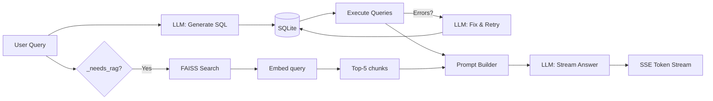

# Hybrid SQL + RAG Pipeline

The RAG pipeline is the core intelligence of CogniLight's AI chat. It combines two context sources — direct SQL queries for structured data and semantic search over incident logs — to build a rich prompt for the LLM.

---

## Pipeline Overview



---

## Step 1: Query Classification

RAG context is **included by default**. The `_needs_rag()` function identifies whether the query benefits from incident log context:

```python
_SQL_ONLY_KEYWORDS = re.compile(
    r"^(?:what time|current time|how many poles|list poles|pole count)\b",
    re.I,
)

def _needs_rag(query: str) -> bool:
    return not bool(_SQL_ONLY_KEYWORDS.search(query))
```

This opt-out approach is simpler and more robust than trying to enumerate all keywords that *should* trigger RAG. Most user questions benefit from narrative incident context, so it makes sense to include it unless we're confident it's unnecessary.

**Examples:**

| Query | RAG? | Why |
|-------|------|-----|
| "Which poles consume the most energy?" | Yes | Included by default — incident context may explain spikes |
| "Have there been any recurring sensor problems?" | Yes | Included by default — incident logs are directly relevant |
| "What maintenance was done on POLE-07?" | Yes | Included by default — incident logs are directly relevant |
| "What time is it?" | No | Matches `_SQL_ONLY_KEYWORDS` — trivial factual lookup |
| "How many poles are there?" | No | Matches `_SQL_ONLY_KEYWORDS` — trivial factual lookup |

---

## Step 2: Text-to-SQL (Always)

Instead of hardcoded queries, `chain.py` uses a text-to-SQL approach: the LLM generates targeted SQL queries based on the user's question.

### SQL Generation

The LLM receives a prompt containing the database schema (from `get_table_schema()`), column descriptions, pole zone mappings, and the user's question. It returns a JSON array of 1-5 query objects:

```json
[
  {"label": "Current readings per pole", "sql": "SELECT * FROM TelemetryReadings WHERE ..."},
  {"label": "Energy trends last hour", "sql": "SELECT PoleId, AVG(EnergyWatts) ..."}
]
```

This is a non-streaming LLM call (`_call_llm()`) with `temperature=0.0` for deterministic output.

### Execution & Safety

`execute_queries()` in `rag/sql_context.py` runs each query against SQLite:

- **Only SELECT queries are allowed** — any non-SELECT statement is rejected with an error
- **Max 200 rows** per query result (`MAX_QUERY_ROWS`)
- Errors are captured per-query (the pipeline continues with partial results)

### Retry on Failure

If any queries fail, `chain.py` sends the errors back to the LLM via `_fix_failed_queries()`, which asks it to fix the SQL based on the error messages. The fixed queries are executed and merged with the successful results.

### Fallback

If the LLM generates no queries (empty response or parse failure), a simple fallback is used:

```sql
SELECT * FROM TelemetryReadings ORDER BY Id DESC LIMIT 50
```

### Formatted Output

`format_query_results()` converts the results into a text block for the final LLM prompt:

```
--- QUERY RESULTS ---

### Current readings per pole
SQL: SELECT * FROM TelemetryReadings WHERE Id IN (...)
(12 rows)
| Id | PoleId | Timestamp | EnergyWatts | ... |
|---|---|---|---|---|
| 1234 | POLE-01 | 2026-03-20 14:23:01 | 142 | ... |
...

--- END QUERY RESULTS ---
```

---

## Step 3: RAG Retrieval (Default-On)

Unless `_needs_rag()` returns False, the retriever performs a semantic search:

### Embedding

```python
def embed_query(query: str) -> NDArray[np.float32]:
    return embed_texts([query])[0]
```

In production mode, this uses `sentence-transformers/all-MiniLM-L6-v2` (384-dimensional embeddings). In demo mode, it generates deterministic pseudo-embeddings from a fixed random seed.

### FAISS Search

```python
class Retriever:
    def search(self, query: str, top_k: int = 5) -> list[Chunk]:
        q_vec = embed_query(query).reshape(1, -1)
        k = min(top_k, self.index.ntotal)
        _, indices = self.index.search(q_vec, k)
        return [self.chunks[i] for i in indices[0] if i < len(self.chunks)]
```

The FAISS index uses `IndexFlatIP` (flat inner product) on normalized vectors — equivalent to cosine similarity. No quantization or approximate search needed for the small index size (<1000 chunks).

### Chunk Format

Each chunk is an incident log entry, formatted as:

```
[REPAIR] Technician Silva — Investigated energy spike at POLE-07. Lamp driver board showing signs of capacitor degradation. Replaced driver unit on-site.
```

Chunks carry metadata: `timestamp` and `pole_ids` for display in the chat UI.

---

## Step 4: Prompt Building

The prompt is assembled from sections:

1. **System instruction** — persona ("You are CogniLight AI"), formatting guidelines, zone awareness
2. **Pole zone reference** — hardcoded descriptions of each pole's expected activity patterns
3. **Query results** — the formatted SQL output from Step 2
4. **RAG context** (if applicable) — incident log excerpts
5. **User question** — the actual query

The zone reference is particularly important:

```
POLE-01: Office district — busy 8-18h, dead at night
POLE-04: School zone — sharp peaks at 7:30-8:30 and 15-16h, empty nights
...
```

This enables the LLM to reason about *why* a reading is normal or anomalous. For example, it can explain that high pedestrian counts at POLE-04 at 15:30 are expected (school pickup) while the same reading at 23:00 would be suspicious.

---

## Step 5: LLM Streaming

The service makes two types of LLM calls: a non-streaming call for SQL generation (Step 2) and a streaming call for the final answer. Both support two providers:

### Anthropic (Claude)

Uses the Messages API with `stream: true`:

```python
async with client.stream("POST", f"{base_url}/v1/messages",
    headers={"x-api-key": cfg.api_key, "anthropic-version": "2023-06-01"},
    json={"model": model, "messages": [...], "stream": True},
) as resp:
    async for line in resp.aiter_lines():
        # Parse SSE events, yield text_delta content
```

### OpenAI (Compatible)

Uses the Chat Completions API with `stream: true`:

```python
async with client.stream("POST", f"{base_url}/chat/completions",
    headers={"Authorization": f"Bearer {cfg.api_key}"},
    json={"model": model, "messages": [...], "stream": True},
) as resp:
    async for line in resp.aiter_lines():
        # Parse SSE events, yield delta content
```

Both implementations use `httpx` for async streaming HTTP.

---

## Data Freshness

A critical property: **SQL context is always fresh**. Every query runs against the live database, so the LLM always sees the current network state. This is unlike pure RAG systems where context may be stale.

The RAG index is refreshed every 10 seconds via the background ingestion loop, so incident logs are available within seconds of being created by the backend.
