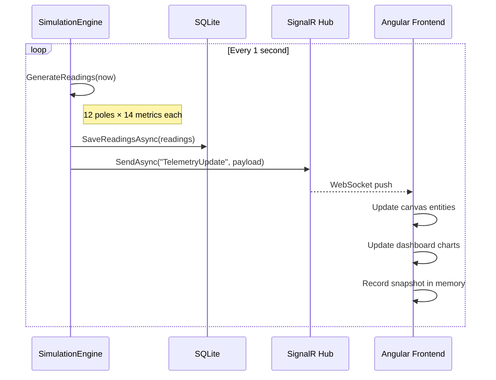
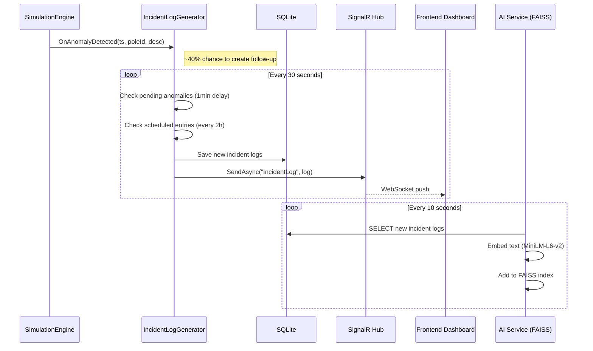
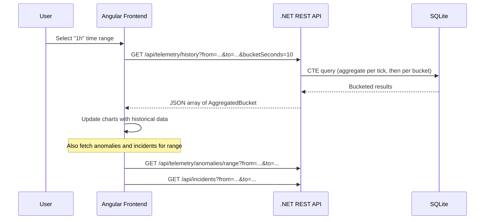
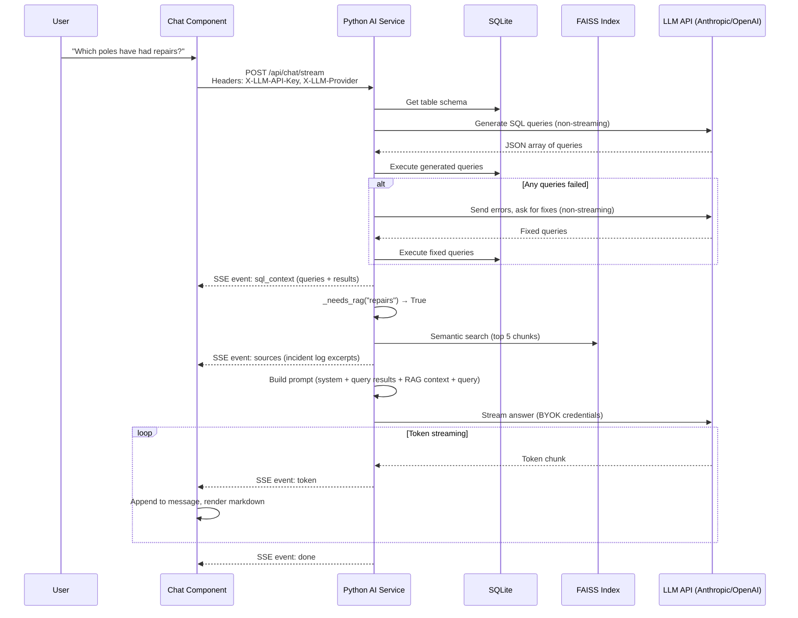

# Data Flow

This page traces how data moves through the system for the three main user interactions: viewing real-time telemetry, querying historical data, and chatting with the AI.

---

## Real-Time Telemetry Flow

This is the primary data path — it runs continuously once the backend starts.

**Step by step:**

1. **`SimulationEngine.Tick()`** fires every second via a `System.Threading.Timer`
2. For each of the 12 poles, `GeneratePoleReading()` computes telemetry based on:
    - The pole's zone type (Office, Retail, Park, etc.) and the current hour
    - Exponential smoothing to prevent jarring jumps between ticks
    - A deterministic solar curve for ambient light
    - Random anomaly injection (~0.3% chance per pole per tick)
3. Readings are saved to SQLite via EF Core (`TelemetryService.SaveReadingsAsync`)
4. The same readings are broadcast to all connected clients via SignalR
5. On the frontend, `TelemetryService` receives the update and pushes it to two RxJS subjects:
    - `readings$` — consumed by the simulation canvas (entity sync) and dashboard (KPI cards, tables)
    - `history$` — an in-memory rolling window of 120 aggregate snapshots for the "LIVE" chart mode
6. Anomalies are extracted from the readings and pushed to `anomalies$`
7. If an anomaly is generated, the `IncidentLogGenerator` is notified and may create a follow-up log entry after a delay

---

## Incident Log Flow

Incident logs are free-text maintenance reports generated alongside telemetry. They flow through a separate path because they're less frequent and serve a different purpose (providing narrative context for the AI).

Two sources of incident logs:

1. **Anomaly follow-ups** — when the simulation engine generates an anomaly, it calls `IncidentLogGenerator.OnAnomalyDetected()`. About 40% of anomalies get a follow-up log (simulating a technician responding). The log is created after a 1-minute delay to simulate response time.
2. **Scheduled entries** — every 2 hours, the generator creates a routine entry (inspection, predictive maintenance, sensor cleaning, or automated diagnostics).

The AI service polls for new incident logs every 10 seconds and ingests them into its FAISS index for semantic retrieval.

---

## Historical Data Query Flow

When a user selects a time range other than "LIVE" on the dashboard, the frontend switches from WebSocket-pushed data to REST-fetched historical data.

The aggregation query uses a two-pass CTE approach:

1. **First pass (TickAgg):** Groups readings by epoch second and SUMs across all 12 poles — this gives the per-tick network total
2. **Second pass:** Buckets the per-tick totals into the requested bucket size (e.g., 10 seconds for 1h view) and AVERAGEs them

This two-pass approach avoids a subtle scaling bug: if you directly bucket and SUM, a 10-second bucket containing 10 ticks would show 10x the energy of a single tick.

---

## AI Chat Query Flow

The most complex data flow involves the AI chat, which combines SQL queries, optional RAG retrieval, and LLM streaming.

**Key design choices visible here:**

1. **Text-to-SQL** — instead of hardcoded queries, the LLM generates targeted SQL based on the user's question. This means the AI fetches exactly the data it needs to answer, rather than always pulling the same three snapshots.
2. **Retry on failure** — if any generated queries fail, the errors are sent back to the LLM for correction. This makes the pipeline resilient to minor SQL mistakes.
3. **Safety constraints** — only SELECT queries are allowed; results are capped at 200 rows per query. If the LLM generates no queries, a simple `SELECT * LIMIT 50` fallback is used.
4. **RAG is included by default** — incident log context is added to every query unless it matches a narrow `_SQL_ONLY_KEYWORDS` pattern (trivial factual lookups like "what time is it"). This opt-out approach ensures the LLM has narrative context for the vast majority of queries.
5. **BYOK (Bring Your Own Key)** — the API key is sent per-request in HTTP headers, never stored server-side. The frontend persists it in `localStorage`.
6. **Structured SSE events** — before any LLM tokens arrive, the frontend receives `sql_context` and `sources` events. This allows the UI to show "what data the AI is looking at" as expandable panels.
7. **Streaming** — tokens arrive one-by-one via SSE, rendered as they arrive with markdown formatting.

---

## Data Retention

The system implements a simple retention policy:

- **On startup:** Telemetry readings and incident logs older than 3 days are pruned (`Program.cs` startup block)
- **During operation:** The `TelemetryService` randomly triggers pruning of both tables (1% chance per tick) to avoid per-tick overhead while keeping the DB from growing unbounded
- **FAISS index:** In-memory only, rebuilt from SQLite on service restart. Not persisted to disk.
