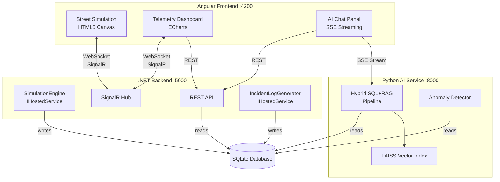

# Architecture Overview

CogniLight follows a three-service architecture where each service owns a distinct responsibility. This separation exists not because the project is too large for a monolith, but because it reflects the real-world architecture of IoT platforms: edge devices generate telemetry, a core platform stores and serves it, and specialized services consume it for analytics.

---

## System Diagram



---

## Service Responsibilities

### Backend (.NET 10)

The backend is the data authority. It:

- **Generates telemetry** via `SimulationEngine`, a background service that ticks once per second and produces readings for all 12 poles
- **Persists data** to SQLite via Entity Framework Core
- **Pushes updates** to all connected frontends via SignalR (`TelemetryHub`)
- **Serves historical data** via REST endpoints for time-range queries
- **Generates incident logs** via `IncidentLogGenerator`, another background service that creates realistic maintenance reports

### Frontend (Angular 21)

The frontend is a single-page application with three visual layers:

- **Street Simulation** — an HTML5 Canvas rendering of the city block with animated entities driven by real-time telemetry
- **Telemetry Dashboard** — ECharts-based charts and KPI cards, with time-range selection and per-pole drill-down
- **AI Chat Panel** — a sliding panel for natural language queries, with SSE streaming and markdown rendering

### AI Service (Python FastAPI)

The AI service provides intelligence on top of the raw data:

- **Hybrid SQL+RAG pipeline** — every query gets fresh SQL context (current state, rankings, anomalies); maintenance/incident queries additionally get semantically relevant incident logs from FAISS
- **FAISS vector index** — incident logs are embedded using `all-MiniLM-L6-v2` and stored in an in-memory FAISS index for semantic retrieval
- **Anomaly detection** — rule-based classification of anomalies by severity

---

## Communication Patterns

The system uses three distinct communication patterns, each chosen for its specific use case:

| Pattern | Used For | Why |
|---------|----------|-----|
| **WebSocket (SignalR)** | Real-time telemetry push, incident log events | Data changes every second; polling would waste bandwidth and add latency |
| **REST** | Historical data queries, pole layout, simulation status | Request/response for on-demand, parameterized queries |
| **SSE (Server-Sent Events)** | AI chat streaming | LLM responses arrive token-by-token; SSE provides a natural streaming primitive without the complexity of full-duplex WebSocket |

---

## The Shared Database

All three services access the same SQLite database file. This is an intentional simplification:

- The **backend** has read-write access — it's the sole writer
- The **AI service** has read-only access via SQLAlchemy — it only queries for context
- In production, both containers mount the same Docker volume (`/data/cognilight.db`)

This avoids the complexity of inter-service REST calls for the AI service to get telemetry. SQLite's WAL (Write-Ahead Logging) mode handles concurrent reads from multiple processes safely.

!!! note "Why not a REST API between services?"
    The AI service could query the backend's REST API instead of reading SQLite directly. We chose direct DB access because:

    1. The AI service needs to run complex aggregation queries (rankings, time ranges) that would require many REST calls
    2. SQLite handles multi-reader/single-writer safely with WAL mode
    3. It eliminates a network hop in the hot path (every chat query)

    The trade-off: the AI service is coupled to the database schema. In a production system with multiple teams, you'd likely add an API layer.

---

## Nginx as API Gateway

In the containerized setup, the frontend's Nginx server doubles as a reverse proxy, routing requests to the appropriate backend service:

```
/api/chat/*        → ai-service:8000   (AI endpoints)
/api/anomalies/*   → ai-service:8000   (anomaly endpoints)
/api/*             → backend:5000      (all other API routes)
/hubs/*            → backend:5000      (SignalR WebSocket)
/*                 → static files      (Angular SPA)
```

This means the browser only ever talks to one origin (port 4200), avoiding CORS issues entirely in Docker mode. The order of Nginx `location` blocks matters — more specific paths (`/api/chat/`) are matched before the general `/api/` catch-all.
