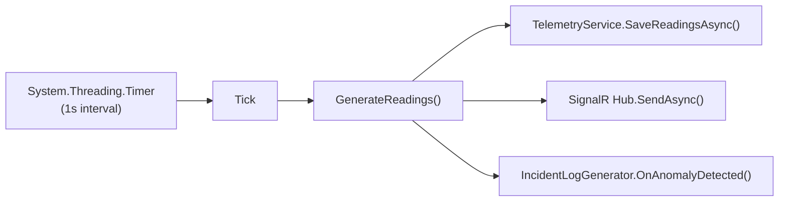

# Simulation Engine

`SimulationEngine` (`Services/SimulationEngine.cs`) is the backbone of CogniLight. It runs as an `IHostedService`, ticking once per second to generate telemetry for all 12 poles and push it to connected clients via SignalR.

---

## Architecture



The engine is registered as a **singleton** and also as a hosted service:

```csharp
builder.Services.AddSingleton<SimulationEngine>();
builder.Services.AddHostedService(sp => sp.GetRequiredService<SimulationEngine>());
```

This dual registration ensures a single instance is both accessible via DI and managed by the host lifecycle.

---

## Zone-Based Activity Profiles

Each of the 12 poles is assigned a zone type that determines its activity profile:

| Pole | Zone | Peak Activity | Quiet Period |
|------|------|--------------|--------------|
| POLE-01 | Office | 8:00–18:00 (work hours) | Night |
| POLE-02 | Retail | 10:00–20:00 (shopping hours) | Night |
| POLE-03 | Park | 6:00–9:00, 17:00–20:00 (morning/evening) | Night |
| POLE-04 | School | 7:30–8:30, 15:00–16:00 (drop-off/pickup) | Night, weekends |
| POLE-05 | Mall | 10:00–21:00 (retail hours) | Night |
| POLE-06 | Apartment | 7:00–9:00, 17:00–19:00 (commute) | Work hours |
| POLE-07 | Gym | 6:00–8:00, 17:00–21:00 (exercise peaks) | Late night |
| POLE-08 | Residential | 7:00–9:00, 17:00–19:00 (commute) | Work hours |
| POLE-09 | Cafe | 7:00–10:00, 12:00–14:00 (coffee, lunch) | Night |
| POLE-10 | Mixed-use | Moderate all day | Late night |
| POLE-11 | Tower | 8:00–18:00 (high vehicle traffic) | Night |
| POLE-12 | Hotel | Steady all day | Slightly lower overnight |

The `GetZoneActivity()` method returns `(pedestrianMultiplier, vehicleMultiplier, cyclistMultiplier)` for a given zone and hour. These multipliers are target values for the exponential smoothing algorithm.

---

## Exponential Smoothing

Real sensor values don't jump — they drift. The engine uses exponential smoothing to create realistic transitions:

```csharp
private double Smooth(double current, double target, double alpha, double noiseScale)
{
    var smoothed = current + alpha * (target - current);
    smoothed += (_rng.NextDouble() - 0.5) * 2 * noiseScale;
    return smoothed;
}
```

**Parameters:**

- `alpha` — Controls convergence speed. Lower = smoother, slower drift.
    - `0.05` for entity counts (takes ~20 ticks to mostly converge)
    - `0.02` for temperature/humidity (slower drift — environmental changes are gradual)
    - `0.06` for AQI/noise (moderate — influenced by nearby traffic)
    - `0.08` for energy (responds faster to dimming changes)
- `noiseScale` — Adds Gaussian-like noise to prevent perfectly smooth curves

Each pole maintains its own `PoleState` object that persists between ticks:

```csharp
private class PoleState
{
    public double Pedestrians;
    public double Vehicles;
    public double Cyclists;
    public double Temperature;
    public double Humidity;
    public double AirQuality;
    public double Noise;
    public double Energy;
}
```

---

## Sensor Models

### Ambient Light (Solar Curve)

A deterministic function of the hour — no noise, because ambient light is a physical constant:

```csharp
private double CalculateAmbientLight(double hour)
{
    if (hour < 5 || hour > 21) return 2;           // Night: ~2 lux
    if (hour < 7) return (hour - 5) / 2.0 * 10000; // Dawn ramp
    if (hour > 19) return (21 - hour) / 2.0 * 10000; // Dusk ramp
    var peak = 1 - Math.Abs(hour - 13) / 6.0;
    return 10000 + peak * 90000;                    // Daytime: 10k–100k lux
}
```

### Adaptive Dimming

Light output inversely correlates with ambient light and boosts when entities are detected:

```csharp
private static double CalculateLightLevel(double ambientLux, int entityCount)
{
    var baseDim = Math.Clamp(100 - ambientLux / 1000.0, 0, 100);
    var presenceBoost = Math.Min(entityCount * 2.0, 30);
    return Math.Clamp(baseDim + presenceBoost, 0, 100);
}
```

At noon (100,000 lux), base dimming is 0%. At midnight (2 lux), it's ~100%. Presence of entities adds up to 30% boost.

### Energy Consumption

Follows light level with smoothing: `targetEnergy = 50 + lightLevel * 2.0`, giving a range of 50W (daytime, no presence) to 250W (night, full output).

### Environmental Sensors

- **Temperature:** Sinusoidal daily cycle peaking at 14:00, range 15–35°C
- **Humidity:** Inverse of temperature cycle, range 40–80%
- **AQI:** Base 40 + vehicle count × 3, range 20–150
- **Noise:** Base 35 + vehicles × 2.5 + pedestrians × 0.5, range 30–85 dB

---

## Anomaly Injection

Anomalies are injected with a ~0.3% base chance per pole per tick — roughly one every 5 minutes across all 12 poles.

```csharp
if (_rng.NextDouble() > 0.003) return (false, null);
```

The engine builds a context-aware candidate pool:

| Anomaly Type | Condition | Example |
|-------------|-----------|---------|
| **Pedestrian cluster** | Zone expected activity < 1.0 (quiet period) | "Unusual pedestrian cluster near POLE-04 (school zone) during off-hours" |
| **Energy spike** | Always eligible | "Sudden energy spike on POLE-07 — possible malfunction" |
| **Sensor dropout** | Always eligible | "Sensor dropout on POLE-01 — null readings detected" |
| **AQI spike** | Low traffic (pedestrians + AQI < 80) | "Air quality spike at POLE-09 uncorrelated with traffic" |

When an anomaly is selected:

1. **Energy spikes** set the pole's energy to 240W (near max)
2. **Crowd clusters** add a plausible spike to pedestrian count
3. The `IncidentLogGenerator` is notified to potentially create a follow-up report

The random number generator uses a fixed seed (`new Random(42)`) for reproducible simulation behavior during development.

---

## Pole Layout

Pole positions are defined as normalized coordinates (0.0–1.0), mapped to world coordinates in the frontend renderer:

```csharp
private static readonly (double X, double Y)[] PolePositions =
[
    (0.22, 0.12), (0.22, 0.35), (0.22, 0.65), (0.22, 0.88),
    (0.32, 0.12), (0.32, 0.35),
    (0.32, 0.65), (0.32, 0.88),
    (0.68, 0.12), (0.68, 0.50),
    (0.78, 0.35), (0.78, 0.88),
];
```

The layout is exposed via `GET /api/simulation/poles` for the frontend to position poles on the canvas.
