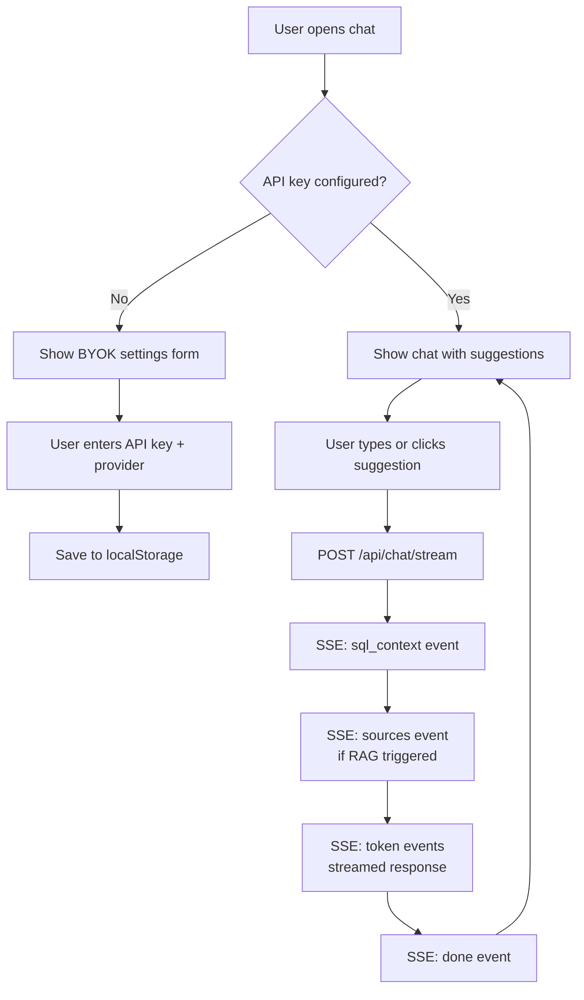

# AI Chat Panel

The chat panel provides a natural language interface for querying telemetry data. It supports SSE streaming, markdown rendering, BYOK (Bring Your Own Key) configuration, and displays the AI's data sources alongside its responses.

---

## User Flow



---

## BYOK Configuration

The chat requires an LLM API key to function. The `AiService` manages this:

```typescript
// Stored in localStorage as JSON
{ "apiKey": "sk-...", "provider": "anthropic", "model": "" }
```

Supported providers:

| Provider | Default Model | API Endpoint |
|----------|--------------|-------------|
| Anthropic | `claude-haiku-4-5-20251001` | `https://api.anthropic.com/v1/messages` |
| OpenAI | `gpt-4.1-nano` | `https://api.openai.com/v1/chat/completions` |

The key is sent per-request via HTTP headers — never stored server-side:

```typescript
headers['X-LLM-API-Key'] = config.apiKey;
headers['X-LLM-Provider'] = config.provider;
if (config.model) headers['X-LLM-Model'] = config.model;
```

---

## SSE Streaming

The chat doesn't use the browser's `EventSource` API because `EventSource` only supports GET requests. Instead, it uses `fetch()` with a `ReadableStream` reader:

```typescript
const resp = await fetch('/api/chat/stream', {
  method: 'POST',
  headers: this.getLLMHeaders(),
  body: JSON.stringify({ message }),
});

const reader = resp.body!.getReader();
const decoder = new TextDecoder();
let buffer = '';
```

### SSE Event Parsing

The response is a stream of SSE events. The component manually parses them:

1. Read chunks from the stream
2. Normalize `\r\n` to `\n`
3. Split on double newlines (SSE event boundary)
4. Extract `event:` and `data:` fields from each block

### Event Types

The stream emits four event types in order:

| Event | When | Payload | UI Effect |
|-------|------|---------|-----------|
| `sql_context` | Always, first | LLM-generated SQL queries + results | Show expandable "Data Sources" panel |
| `sources` | If RAG triggered | Incident log excerpts | Show expandable "Incident Logs" panel |
| `token` | During LLM streaming | Text fragment | Append to message, re-render markdown |
| `done` | End of response | Empty | Stop loading indicator |

---

## Message Types

Each message in the chat has a rich structure:

```typescript
interface ChatMessage {
  role: 'user' | 'assistant';
  content: string;           // The text content (markdown)
  sources?: SourceInfo[];     // RAG source excerpts
  sqlQueries?: SqlQueryInfo[]; // SQL queries the AI executed
  timestamp: Date;
  streaming?: boolean;        // Currently receiving tokens
  sourcesOpen?: boolean;      // UI toggle state
  sqlOpen?: boolean;          // UI toggle state
}
```

Assistant messages can include expandable sections showing:

1. **SQL Queries** — the actual SQL that was run, with result tables
2. **Incident Log Sources** — the RAG-retrieved chunks, with timestamps and pole IDs

This transparency helps users understand *what data the AI is working with*, which builds trust in the responses.

---

## Suggested Prompts

On first load (or new chat), the component fetches suggestions from `GET /api/chat/suggestions`:

```json
[
  "Summarize the last hour of telemetry",
  "Which poles are consuming the most energy right now?",
  "Any maintenance issues or incidents reported recently?",
  "Have there been any recurring sensor problems?",
  "What's the current air quality across the network?",
  "Which poles have had repairs done?"
]
```

Clicking a suggestion sends it as a message.

---

## Markdown Rendering

Assistant messages are rendered as HTML via a custom `MarkdownPipe`. This supports:

- **Bold** and *italic* text
- Bullet lists and numbered lists
- Tables (for structured data responses)
- Code blocks (for technical details)

The pipe is applied in the template:

```html
<div [innerHTML]="message.content | markdown"></div>
```

---

## Error Handling

- **No API key:** Shows inline message, doesn't call the backend
- **Network error:** Shows "Connection error: Unable to reach the AI service"
- **LLM error:** The Python service catches exceptions and streams an error message as a regular token
- **Malformed SSE:** Silently skipped (try/catch around JSON.parse)

---

## Chat State

- **New Chat** — clears all messages, resets input
- **Settings Toggle** — opens/closes the BYOK configuration form
- **Clear API Key** — removes from localStorage, resets chat
- **Loading State** — disables send button, shows streaming indicator
- **Fullscreen Mode** — `LayoutService.chatFullscreen` hides sim+dashboard and gives chat the full width
