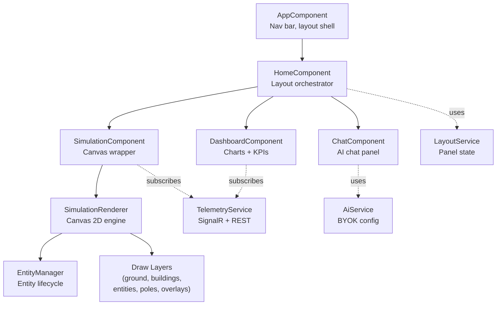

# Frontend (Angular 21)

The frontend is an Angular 21 single-page application that renders three visual layers: a canvas-based street simulation, an ECharts telemetry dashboard, and an AI chat panel.

---

## Key Design Choices

- **Standalone components** — every component uses `standalone: true`. No `NgModule` declarations.
- **Signals** — Angular's signal API is used for reactive state in services (`LayoutService`, `AiService`).
- **RxJS for external data** — SignalR events flow through `BehaviorSubject` streams. Components subscribe with `takeUntil` for cleanup.
- **`runOutsideAngular`** — The canvas animation loop runs outside Angular's zone to avoid triggering change detection 60 times per second.
- **Lazy loading** — The single route lazy-loads `HomeComponent` to keep the initial bundle minimal.

---

## Component Architecture



---

## Project Structure

```
frontend/src/app/
├── app.ts                        # Root component (nav bar)
├── app.html / app.scss           # Root template and styles
├── app.routes.ts                 # Single route → HomeComponent (lazy)
├── theme.scss                    # CSS custom properties (design tokens)
├── home/
│   └── home.component.ts         # Layout: sim | divider | dashboard + chat
├── simulation/
│   ├── simulation.component.ts   # Canvas wrapper, SignalR subscription
│   ├── simulation.renderer.ts    # Orchestrator: update loop + draw pipeline
│   └── renderer/
│       ├── theme.ts              # Canvas color constants (RT)
│       ├── world-layout.ts       # Roads, buildings, poles definitions
│       ├── iso-projection.ts     # World-to-screen coordinate mapping
│       ├── entity-manager.ts     # Entity spawn/fade/remove lifecycle
│       └── layers/
│           ├── ground.layer.ts   # Roads, sidewalks, lane markings
│           ├── buildings.layer.ts # Building extrusions with labels
│           ├── entities.layer.ts # Pedestrians, vehicles, cyclists
│           ├── poles.layer.ts    # Pole circles, glow effects, anomaly rings
│           └── overlays.layer.ts # Pole ID labels, selection highlights
├── dashboard/
│   ├── dashboard.component.ts    # KPIs, time range, chart management
│   ├── dashboard.component.html  # Grid layout with ECharts directives
│   └── dashboard.component.scss  # Dashboard-specific styles
├── chat/
│   ├── chat.component.ts         # SSE streaming, BYOK form, message handling
│   ├── chat.component.html       # Chat bubbles, settings panel
│   └── chat.component.scss       # Chat-specific styles
└── shared/
    ├── models/
    │   └── telemetry.model.ts    # TelemetryReading, TelemetryUpdate interfaces
    ├── services/
    │   ├── telemetry.service.ts  # SignalR connection, REST calls, RxJS streams
    │   ├── layout.service.ts     # Panel visibility signals
    │   └── ai.service.ts         # BYOK localStorage management
    ├── pipes/
    │   └── markdown.pipe.ts      # Markdown → HTML for chat messages
    └── chart-theme.ts            # ECharts color constants (CT)
```

---

## Layout System

`HomeComponent` orchestrates the three panels:

```
┌──────────────────────────────────────────────────────┐
│  Nav Bar (AppComponent)           [Map] [Chat] [AI]  │
├────────────┬──┬────────────────────┬─────────────────┤
│            │  │                    │                  │
│ Simulation │÷ │   Dashboard        │   Chat Panel     │
│ (Canvas)   │  │   (ECharts)        │   (380px)        │
│   45%      │  │   flex: 1          │                  │
│            │  │                    │                  │
└────────────┴──┴────────────────────┴─────────────────┘
```

- The **divider** is clickable — it collapses/expands the simulation panel with a CSS transition
- The **chat panel** slides in from the right (380px fixed width) or goes fullscreen
- `LayoutService` manages state via Angular signals: `simCollapsed`, `chatOpen`, `chatFullscreen`

---

## Services

### TelemetryService

The central data hub. Manages:

- **SignalR connection** — connects to `/hubs/telemetry`, handles reconnection, pushes events to RxJS subjects
- **In-memory state** — `readings$` (latest per pole), `history$` (rolling 120-snapshot window), `anomalies$`, `incidentLogs$`
- **REST methods** — `getHistory()`, `getPoleHistory()`, `getAnomaliesInRange()`, `getIncidentLogs()` for time-range queries
- **Pole selection** — `selectedPoleId$` coordinates selection between the simulation canvas and dashboard

### LayoutService

Three signals controlling panel visibility. Used by `HomeComponent`, `AppComponent` (nav bar), and `ChatComponent`.

### AiService

Manages LLM configuration in `localStorage`:

```typescript
const STORAGE_KEY = 'cognilight_llm';
// Stores: { apiKey, provider, model }
```

Exposes a `configured` signal that gates the chat send button.

---

## What's Next

- [Street Simulation](simulation.md) — the canvas rendering engine
- [Telemetry Dashboard](dashboard.md) — ECharts charts and time-range queries
- [AI Chat Panel](chat.md) — SSE streaming and BYOK flow
- [Theme System](theming.md) — the three-file theming approach
