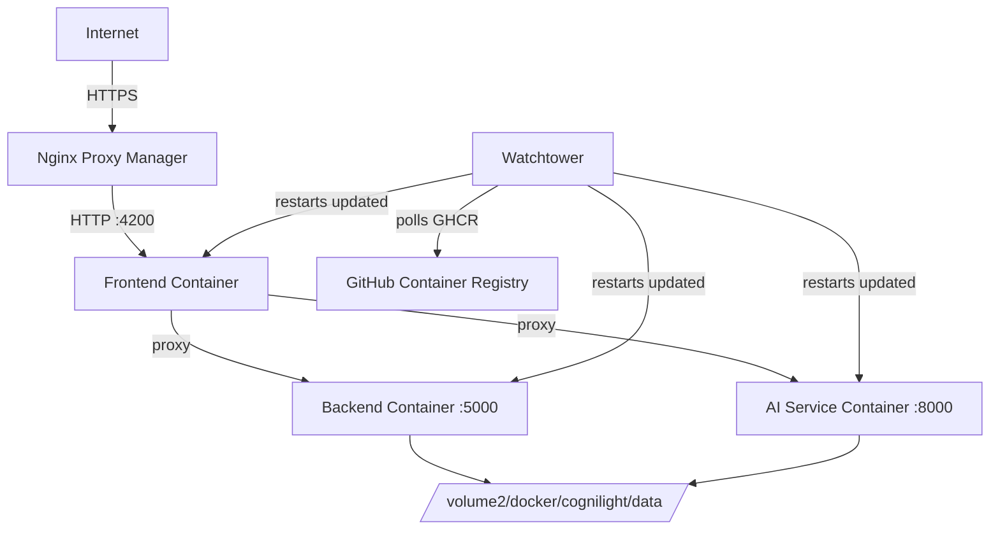

# NAS Deployment

CogniLight is deployed to a Synology NAS running Docker, with Nginx Proxy Manager handling HTTPS termination and Watchtower automating image updates.

---

## Deployment Architecture



---

## Setup Steps

### 1. Clone and Configure

```bash
ssh nas
cd /volume2/docker
git clone https://github.com/{owner}/CogniLight.git cognilight
cd cognilight
cp .env.prod.example .env
# Edit .env with real values:
#   IMAGE_PREFIX=ghcr.io/{owner}/cognilight
#   CORS_ORIGINS=https://cognilight.muchagato.dev
```

### 2. Create Data Directory

```bash
mkdir -p /volume2/docker/cognilight/data
```

### 3. Pull and Start

```bash
docker compose -f docker-compose.prod.yml pull
docker compose -f docker-compose.prod.yml up -d
```

### 4. Configure Nginx Proxy Manager

Add a proxy host:

| Field | Value |
|-------|-------|
| Domain | `cognilight.muchagato.dev` |
| Forward Hostname | `cognilight-frontend` |
| Forward Port | `4200` |
| SSL | Let's Encrypt, Force SSL |
| WebSockets Support | Enabled |

The WebSockets option is critical — without it, SignalR will fall back to long polling.

---

## Automatic Updates with Watchtower

All three containers have the Watchtower label:

```yaml
labels:
  - "com.centurylinklabs.watchtower.enable=true"
```

Watchtower (running as a separate container on the NAS) periodically checks GHCR for new `:latest` images. When it finds an update, it:

1. Pulls the new image
2. Stops the old container
3. Starts a new container with the same configuration

This means pushing to `main` triggers a fully automated deployment:

```
git push → GitHub Actions builds → GHCR stores images → Watchtower pulls → Containers restart
```

---

## Network Architecture

The production compose file uses an external network:

```yaml
networks:
  nginx_internal_network:
    external: true
```

This network is shared with Nginx Proxy Manager, allowing it to reach the frontend container by name (`cognilight-frontend`). No ports are published to the host — all traffic routes through the reverse proxy.

---

## Data Persistence

The SQLite database is stored at `/volume2/docker/cognilight/data/cognilight.db` on the NAS filesystem (not a Docker volume). This means:

- The database survives container recreation
- It can be backed up via Synology's built-in backup tools
- It's accessible from the NAS shell for debugging

---

## Monitoring

Currently, monitoring is minimal:

- **Backend health:** `GET /health` — returns `{"status":"ok","service":"backend"}`
- **AI service health:** `GET /health` — returns `{"status":"ok","service":"ai-service","index_size":"..."}`
- **Container logs:** `docker logs cognilight-backend -f`
- **Simulation status:** `GET /api/simulation/status`

In a production deployment, you'd add:

- Container health checks in the compose file using these endpoints
- A monitoring stack (Prometheus + Grafana)
- Alerting on container restarts or health check failures
