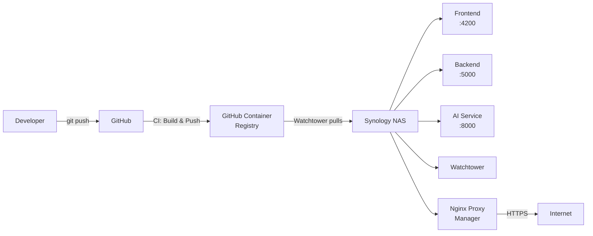

# Infrastructure

CogniLight runs as three Docker containers orchestrated by Docker Compose. The CI/CD pipeline builds images on push to `main`, publishes them to GitHub Container Registry, and a Watchtower instance on the deployment target (a Synology NAS) automatically pulls updates.

---

## Overview

---

## What's Next

- [Docker Setup](docker.md) — container definitions and multi-stage builds
- [CI/CD Pipeline](ci-cd.md) — GitHub Actions workflow
- [NAS Deployment](deployment.md) — production deployment on Synology
